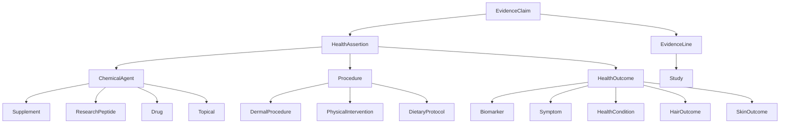

# Health Optimization Knowledge Graph

> **Work in progress.** The data and schema are functional but incomplete. See [TODO.md](TODO.md) for known gaps.

A BFO-aligned, evidence-graded knowledge graph mapping health optimization interventions (supplements, drugs, peptides, procedures) to outcomes, backed by primary literature with explicit evidence grading.

## What is this?

Every claim is an `EvidenceClaim` — a self-contained unit asserting that *[agent/procedure]* *[increases | decreases | modulates | ...]* *[outcome]*, with:

- One or more `EvidenceLine` entries linking to specific studies
- **GRADE certainty** (high / moderate / low / very low)
- **ECO evidence type** per study (RCT, systematic review, animal, in vitro, ...)
- **Effect sizes** with confidence intervals and p-values where available
- **Claim status** (active, disputed, preliminary, refuted)

## Current coverage

The graph currently focuses on **hair health**. Planned expansions are tracked in [TODO.md](TODO.md).

| Domain | Agents / Procedures |
|---|---|
| Hair — AGA pharmacology | Finasteride, Dutasteride, RU58841, Estradiol |
| Hair — topicals & adjuncts | Minoxidil, Ketoconazole, Caffeine, Saw Palmetto, Pygeum |
| Hair — peptides | BPC-157, TB-500, GHK-Cu |
| Hair — procedures | PRP scalp injection, Scalp microneedling, Red/NIR light therapy |
| Skin | GHK-Cu collagen synthesis, Beef tallow barrier |
| Longevity / NAD+ | NMN |
| Hormonal | HGH, Testosterone, DHT axis |

## Stack

| Layer | Technology |
|---|---|
| Schema | [LinkML](https://linkml.io/) (YAML → JSON Schema / OWL / Python / TypeScript) |
| Data | Hand-curated YAML files in `data/` |
| Build pipeline | Python (`scripts/build_graph.py`) |
| Web UI | React + TypeScript + Vite, [Cytoscape.js](https://cytoscape.js.org/) |
| Docs | MkDocs + Material theme |

## Project layout

```
schema/          # LinkML schema files
data/
  agents/        # drugs/, supplements/, peptides/, topicals/
  concepts/      # biomarkers, hair, skin, ...
  evidence-claims/
  outcomes/
  procedures/
scripts/
  build_graph.py # builds the Cytoscape-ready JSON from YAML data
web/             # React frontend (graph explorer)
docs/            # MkDocs source
Makefile         # validate, generate, docs-serve, docs-deploy
pyproject.toml
```

## Getting started

```bash
# Install Python dependencies
pip install -e ".[dev]"

# Validate the LinkML schema
make validate

# Generate all artifacts (JSON Schema, OWL, Python types, TypeScript types)
make all

# Serve documentation locally
make docs-serve
```

### Run the web UI

```bash
cd web
npm install
npm run dev
```

To rebuild the graph data before starting the frontend:

```bash
python scripts/build_graph.py
```

## Schema overview



## License

MIT
