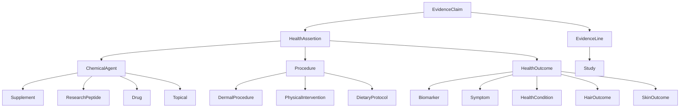

# Health Optimization Knowledge Graph

A BFO-aligned, evidence-graded knowledge graph covering health optimization
interventions, outcomes, and their evidence base.

## What is this?

The Health Optimization KG (HOKG) is a structured, queryable knowledge base
that maps interventions (supplements, drugs, peptides, procedures) to health
outcomes, backed by primary literature with explicit evidence grading.

Every claim is an `EvidenceClaim` — a self-contained unit asserting that
[agent/procedure] [increases | decreases | modulates | ...] [outcome], with:

- One or more `EvidenceLine` entries linking to specific studies
- **GRADE certainty** (high / moderate / low / very low)
- **ECO evidence type** per study (RCT, systematic review, animal, in vitro...)
- **Effect sizes** with confidence intervals and p-values where available
- **Claim status** (active, disputed, preliminary, refuted)

## Health paradigms covered

| Paradigm | Examples |
|---|---|
| Hair health | AGA, microneedling, minoxidil, ketoconazole, finasteride, GHK-Cu |
| Skin health | Collagen, retinoids, tallow, sun protection, PBM |
| Longevity | NMN, spermidine, rapamycin, hallmarks of aging |
| Cognitive | Lion's mane, bacopa, sleep, exercise |
| Metabolic | Berberine, metformin, intermittent fasting, cold exposure |
| Hormonal | Testosterone optimization, thyroid, cortisol |
| … | And more |

## Getting started

```bash
# Install dependencies
pip install -e ".[dev]"

# Validate schema
make validate

# Generate all artifacts (JSON Schema, OWL, Python types, TypeScript types)
make all

# Serve documentation locally
make docs-serve
```

## Schema overview


